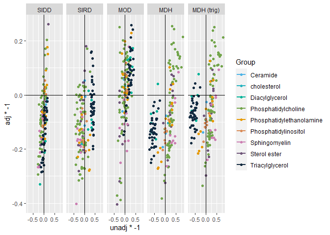

# Comparison

    load("./000.Final_Scripts/002.Clusters.Combine/Lipidomics_Clusters_Meta_SIDD.RData")
    load("./000.Final_Scripts/002.Clusters.Combine/Lipidomics_Clusters_Meta_SIRD.RData")
    load("./000.Final_Scripts/002.Clusters.Combine/Lipidomics_Clusters_Meta_MOD.RData")
    load("./000.Final_Scripts/002.Clusters.Combine/Lipidomics_Clusters_Meta_MARDH.RData")

    meta.SIDD.Lipidomics  <- updateData2(meta.SIDD.lipidomics,lipids)
    meta.SIDD.Lipidomics_adjusted  <- updateData2(meta.SIDD.Lipidomics_adjusted,lipids)

    meta.SIRD.Lipidomics  <- updateData2(meta.SIRD.lipidomics,lipids)
    meta.SIRD.Lipidomics_adjusted  <- updateData2(meta.SIRD.Lipidomics_adjusted,lipids)

    meta.MOD.Lipidomics  <- updateData2(meta.MOD.lipidomics,lipids)
    meta.MOD.Lipidomics_adjusted  <- updateData2(meta.MOD.Lipidomics_adjusted,lipids)

    meta.MDH.Lipidomics <- updateData2(meta.MARDH.lipidomics, lipids)
    meta.MDH.Lipidomics_adjusted <- updateData2(meta.MDH.Lipidomics_adjusted, lipids)
    meta.MDH.Lipidomics_adjusted_trig <- updateData2(meta.MDH.Lipidomics_adjusted_trig, lipids)

    meta.SIDD.Lipidomics_adjusted$Group <-"SIDD"
    meta.SIRD.Lipidomics_adjusted$Group <-"SIRD"
    meta.MOD.Lipidomics_adjusted$Group <-"MOD"
    meta.MDH.Lipidomics_adjusted$Group <-"MDH"
    meta.MDH.Lipidomics_adjusted_trig$Group <- "MDH (trig)"

    meta.SIDD.Lipidomics_adjusted[order(meta.SIDD.Lipidomics_adjusted$fdr.random),][1:5,]

    ##                   var Effect.random      lower      upper Zval.random
    ## 23  DAG.16.1.0_18.1.0     0.3305691  0.2036450  0.4574932    5.104654
    ## 4           CE.16.1.0     0.2592151  0.1321437  0.3862865    3.998164
    ## 11          CE.20.2.0    -0.2615531 -0.3892605 -0.1338458   -4.014136
    ## 116         SM.34.0.2     0.2661873  0.1388244  0.3935502    4.096306
    ## 118         SM.34.2.2     0.2660284  0.1385766  0.3934802    4.091006
    ##      Pval.random I2       Het   fdr.random Group
    ## 23  3.314011e-07  0 0.3922401 5.368697e-05  SIDD
    ## 4   6.383561e-05  0 0.3311433 1.723562e-03  SIDD
    ## 11  5.966401e-05  0 0.7941881 1.723562e-03  SIDD
    ## 116 4.197949e-05  0 0.1848697 1.723562e-03  SIDD
    ## 118 4.295064e-05  0 0.3499227 1.723562e-03  SIDD

    meta.SIRD.Lipidomics_adjusted[order(meta.SIRD.Lipidomics_adjusted$fdr.random),][1:5,]

    ##                  var Effect.random     lower     upper Zval.random  Pval.random
    ## 122        SM.40.1.2     0.4017155 0.2842083 0.5192228    6.700419 2.078227e-11
    ## 56  PC.16.1.0_18.2.0     0.3146142 0.1966479 0.4325805    5.227192 1.721041e-07
    ## 39  PC.14.0.0_18.2.0     0.2941413 0.1751003 0.4131823    4.842922 1.279436e-06
    ## 45  PC.16.0.0_18.2.0     0.2931346 0.1741742 0.4120951    4.829617 1.367960e-06
    ## 62  PC.18.0.0_18.2.0     0.3083197 0.1856870 0.4309524    4.927686 8.320908e-07
    ##             I2       Het   fdr.random Group
    ## 122 0.00000000 0.3610305 3.366727e-09  SIRD
    ## 56  0.00000000 0.2812782 1.394043e-05  SIRD
    ## 39  0.00000000 0.6401358 4.432189e-05  SIRD
    ## 45  0.00000000 0.3765761 4.432189e-05  SIRD
    ## 62  0.04800562 0.1472170 4.432189e-05  SIRD

    meta.MOD.Lipidomics_adjusted[order(meta.MOD.Lipidomics_adjusted$fdr.random),][1:5,]

    ##                 var Effect.random     lower     upper Zval.random  Pval.random
    ## 15        CE.22.6.0     0.4033450 0.2857701 0.5209198    6.723731 1.771291e-11
    ## 54 PC.16.0.0_22.6.0     0.3709314 0.2372612 0.5046016    5.438850 5.362552e-08
    ## 68 PC.18.0.0_22.6.0     0.3883401 0.2494150 0.5272651    5.478728 4.283943e-08
    ## 66 PC.18.0.0_20.5.0     0.3238556 0.2048463 0.4428650    5.333578 9.629613e-08
    ## 14        CE.20.5.0     0.3190648 0.2003818 0.4377479    5.269124 1.370766e-07
    ##           I2        Het   fdr.random Group
    ## 15 0.0000000 0.70020799 2.869491e-09   MOD
    ## 54 0.2229665 0.10864018 2.895778e-06   MOD
    ## 68 0.2661338 0.09877002 2.895778e-06   MOD
    ## 66 0.0000000 0.44934765 3.899993e-06   MOD
    ## 14 0.0000000 0.17961811 4.441282e-06   MOD

    meta.MDH.Lipidomics_adjusted[order(meta.MDH.Lipidomics_adjusted$fdr.random),][1:5,]

    ##                  var Effect.random     lower     upper Zval.random  Pval.random
    ## 49  PC.16.0.0_20.3.0     0.3167556 0.1921457 0.4413656    4.982182 6.287123e-07
    ## 10         CE.18.3.0     0.2653121 0.1510034 0.3796209    4.549102 5.387522e-06
    ## 71  PC.18.1.0_20.3.0     0.2666698 0.1526061 0.3807335    4.582206 4.600971e-06
    ## 100 PE.18.1.0_18.1.0     0.2727900 0.1570865 0.3884935    4.620937 3.820104e-06
    ## 122        SM.40.1.2     0.2623396 0.1475888 0.3770904    4.480806 7.436155e-06
    ##            I2       Het   fdr.random Group
    ## 49  0.1291464 0.1296578 0.0001018514   MDH
    ## 10  0.0000000 0.5265436 0.0002007762   MDH
    ## 71  0.0000000 0.2000806 0.0002007762   MDH
    ## 100 0.0000000 0.5948269 0.0002007762   MDH
    ## 122 0.0000000 0.3433035 0.0002007762   MDH

    table(meta.SIDD.Lipidomics_adjusted$var == meta.SIDD.Lipidomics$var)

    ## 
    ## TRUE 
    ##  162

    pd <- data.frame(
      var = c(
        as.character(meta.SIDD.Lipidomics_adjusted$var), 
        as.character(meta.SIRD.Lipidomics_adjusted$var), 
        as.character(meta.MOD.Lipidomics_adjusted$var), 
        as.character(meta.MDH.Lipidomics_adjusted$var),
        as.character(meta.MDH.Lipidomics_adjusted_trig$var)
        ),
      
      cluster = c(meta.SIDD.Lipidomics_adjusted$Group, 
                  meta.SIRD.Lipidomics_adjusted$Group, 
                  meta.MOD.Lipidomics_adjusted$Group, 
                  meta.MDH.Lipidomics_adjusted$Group,
                  meta.MDH.Lipidomics_adjusted_trig$Group
                  ),
      
      unadj = c(
        meta.SIDD.Lipidomics$Effect.random, 
        meta.SIRD.Lipidomics$Effect.random, 
        meta.MOD.Lipidomics$Effect.random, 
        meta.MDH.Lipidomics$Effect.random,
        meta.MDH.Lipidomics$Effect.random    
        ),
      
      adj = c(
        meta.SIDD.Lipidomics_adjusted$Effect.random,
        meta.SIRD.Lipidomics_adjusted$Effect.random,
        meta.MOD.Lipidomics_adjusted$Effect.random,
        meta.MDH.Lipidomics_adjusted$Effect.random,
        meta.MDH.Lipidomics_adjusted_trig$Effect.random
        )
    )

    pd <- na.omit(pd)

    pd$label <- NA
    pd[abs(pd$unadj) >= 0.4 & sign(pd$unadj) != sign(pd$adj),"label"] <- as.character(pd[abs(pd$unadj) >= 0.4 & sign(pd$unadj) != sign(pd$adj),"var"])

    groups <- rio::import("./002.Data/SwissLipids.csv")

    pd$Group <- groups[match(pd$var, groups$FDBName),"Class"]

    pd$cluster <- factor(pd$cluster, levels=c("SIDD","SIRD","MOD","MDH","MDH (trig)"))

    head(pd)

    ##         var cluster       unadj         adj label        Group
    ## 1 CE.14.0.0    SIDD  0.14742945  0.18302190  <NA> Sterol ester
    ## 2 CE.15.0.0    SIDD  0.06341055  0.05543616  <NA> Sterol ester
    ## 3 CE.16.0.0    SIDD  0.02859915  0.15275140  <NA> Sterol ester
    ## 4 CE.16.1.0    SIDD  0.20719258  0.25921513  <NA> Sterol ester
    ## 5 CE.17.0.0    SIDD -0.03228870 -0.02322024  <NA> Sterol ester
    ## 6 CE.17.1.0    SIDD  0.06901592  0.08980379  <NA> Sterol ester

    ggplot(pd, aes(x=unadj*-1, y=adj*-1, col=Group, group=var, label=var))+
      geom_point()+
      facet_grid(~cluster)+
      geom_smooth(method="lm", se=F)+
      geom_vline(xintercept = 0)+
      geom_hline(yintercept = 0)+
      scale_color_manual(values = colorRampPalette(colors = c("#4DB3E6","#00B399","#E69900","#CC80B3","#132B41"))(9))

    ## `geom_smooth()` using formula 'y ~ x'

    pdf("./000.Final_Scripts/005.Cluster follow-up/Effect size comparison Lipidomics.pdf", width=10, height=3)
    ggplot(pd, aes(x=unadj*-1, y=adj*-1, col=Group, label=label))+
      geom_point(size=2)+
      facet_grid(~cluster)+
      geom_smooth(method = "lm", se=F)+
      geom_vline(xintercept = 0)+
      geom_hline(yintercept = 0)+
      scale_color_manual(values = colorRampPalette(colors = c("#4DB3E6","#00B399","#E69900","#CC80B3","#132B41"))(9))+
      #grepel::geom_label_repel()+
      #theme(legend.position = "none")+
      xlab("Beta unadjusted model")+
      ylab("Beta adjusted model")

    ## `geom_smooth()` using formula 'y ~ x'

    dev.off()

    ## png 
    ##   2
