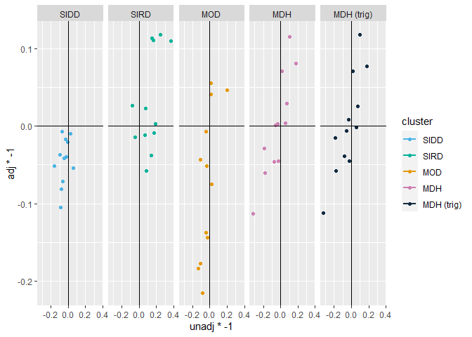

# Comparison

    load("./000.Final_Scripts/002.Clusters.Combine/Metabolomics_Clusters_Meta_SIDD.RData")
    load("./000.Final_Scripts/002.Clusters.Combine/Metabolomics_Clusters_Meta_SIRD.RData")
    load("./000.Final_Scripts/002.Clusters.Combine/Metabolomics_Clusters_Meta_MOD.RData")
    load("./000.Final_Scripts/002.Clusters.Combine/Metabolomics_Clusters_Meta_MARDH.RData")

    meta.SIDD.metabolomics  <- updateData2(meta.SIDD.metabolomics,metabolites)
    meta.SIDD.metabolomics_adjusted  <- updateData2(meta.SIDD.metabolomics_adjusted,metabolites)

    meta.SIRD.metabolomics  <- updateData2(meta.SIRD.metabolomics,metabolites)
    meta.SIRD.metabolomics_adjusted  <- updateData2(meta.SIRD.metabolomics_adjusted,metabolites)

    meta.MOD.metabolomics  <- updateData2(meta.MOD.metabolomics,metabolites)
    meta.MOD.metabolomics_adjusted  <- updateData2(meta.MOD.metabolomics_adjusted,metabolites)

    meta.MDH.metabolomics <- updateData2(meta.MARDH.metabolomics, metabolites)
    meta.MDH.metabolomics_adjusted <- updateData2(meta.MDH.metabolomics_adjusted, metabolites)
    meta.MDH.metabolomics_adjusted_trig <- updateData2(meta.MDH.metabolomics_adjusted_trig, metabolites)

    meta.SIDD.metabolomics_adjusted$Group <-"SIDD"
    meta.SIRD.metabolomics_adjusted$Group <-"SIRD"
    meta.MOD.metabolomics_adjusted$Group <-"MOD"
    meta.MDH.metabolomics_adjusted$Group <-"MDH"
    meta.MDH.metabolomics_adjusted_trig$Group <-"MDH (trig)"

    meta.SIDD.metabolomics[order(meta.SIDD.metabolomics$fdr.random),][1:5,]

    ##          var Effect.random       lower     upper Zval.random Pval.random
    ## 11 SDMA.ADMA    0.16309894  0.05096438 0.2752335   2.8507540  0.00436157
    ## 12   Taurine    0.10045533 -0.01176996 0.2126806   1.7544069  0.07936080
    ## 14       Trp    0.08908144 -0.02310866 0.2012715   1.5562551  0.11964745
    ## 5       Hcit    0.06791290 -0.06422821 0.2000540   1.0073083  0.31378666
    ## 8       Kynu    0.08450113 -0.09561507 0.2646173   0.9195129  0.35782737
    ##           I2        Het fdr.random group
    ## 11 0.0000000 0.25576817 0.03707334  SIDD
    ## 12 0.0000000 0.39150149 0.33728342  SIDD
    ## 14 0.0000000 0.16511686 0.40680132  SIDD
    ## 5  0.2125074 0.11101542 0.81359735  SIDD
    ## 8  0.6020778 0.02496794 0.81359735  SIDD

    meta.SIRD.metabolomics[order(meta.SIRD.metabolomics$fdr.random),][1:5,]

    ##          var Effect.random      lower       upper Zval.random  Pval.random
    ## 6        Ile    -0.1766465 -0.2731223 -0.08017077   -3.588682 0.0003323540
    ## 1       AADA    -0.1864607 -0.2955243 -0.07739700   -3.350852 0.0008056334
    ## 7       IndS    -0.3689597 -0.6161052 -0.12181413   -2.925999 0.0034335176
    ## 11 SDMA.ADMA    -0.1496006 -0.2542608 -0.04494030   -2.801557 0.0050856608
    ## 8       Kynu    -0.2470844 -0.4310552 -0.06311358   -2.632355 0.0084795157
    ##            I2          Het  fdr.random group
    ## 6  0.01638947 0.1538836128 0.001883340  SIRD
    ## 1  0.18243192 0.1178037959 0.003423942  SIRD
    ## 7  0.83306544 0.0005375316 0.011673960  SIRD
    ## 11 0.12639765 0.1302626931 0.014409372  SIRD
    ## 8  0.68887256 0.0112320206 0.018018971  SIRD

    meta.MOD.metabolomics[order(meta.MOD.metabolomics$fdr.random),][1:5,]

    ##        var Effect.random        lower      upper Zval.random  Pval.random I2
    ## 6      Ile   -0.19564997 -0.287753249 -0.1035467  -4.1634448 3.134818e-05  0
    ## 5     Hcit    0.13164338  0.036270327  0.2270164   2.7053373 6.823506e-03  0
    ## 12 Taurine    0.11000133  0.018818152  0.2011845   2.3644563 1.805656e-02  0
    ## 8     Kynu    0.08283411 -0.009760048  0.1754283   1.7533706 7.953842e-02  0
    ## 1     AADA    0.03541961 -0.056923800  0.1277630   0.7517717 4.521884e-01  0
    ##          Het   fdr.random group
    ## 6  0.2387131 0.0005329191   MOD
    ## 5  0.2451379 0.0579997978   MOD
    ## 12 0.8718348 0.0767403589   MOD
    ## 8  0.3285241 0.2253588556   MOD
    ## 1  0.3485811 0.6800023757   MOD

    meta.MARDH.metabolomics[order(meta.MARDH.metabolomics$fdr.random),][1:5,]

    ##        var Effect.random       lower        upper Zval.random  Pval.random
    ## 6      Ile     0.3221895  0.22972241  0.414656566    6.829239 8.536624e-12
    ## 12 Taurine    -0.1789826 -0.27145188 -0.086513286   -3.793685 1.484278e-04
    ## 10     Phe     0.1249531  0.03108989  0.218816375    2.609154 9.076641e-03
    ## 1     AADA     0.1789721  0.02582373  0.332120452    2.290451 2.199517e-02
    ## 5     Hcit    -0.1003230 -0.19688256 -0.003763356   -2.036352 4.171497e-02
    ##           I2        Het   fdr.random group
    ## 6  0.0000000 0.30298580 1.451226e-10   MDH
    ## 12 0.0000000 0.45549554 1.261636e-03   MDH
    ## 10 0.0000000 0.44317327 5.143430e-02   MDH
    ## 1  0.6133221 0.02295029 9.347948e-02   MDH
    ## 5  0.0000000 0.23187954 1.418309e-01   MDH

    table(meta.SIDD.metabolomics_adjusted$var == meta.SIDD.metabolomics$var)

    ## 
    ## TRUE 
    ##   12

    pd <- data.frame(
      var = c(
        as.character(meta.SIDD.metabolomics_adjusted$var), 
        as.character(meta.SIRD.metabolomics_adjusted$var), 
        as.character(meta.MOD.metabolomics_adjusted$var), 
        as.character(meta.MDH.metabolomics_adjusted$var),
        as.character(meta.MDH.metabolomics_adjusted_trig$var)
      ),
      
      cluster = c(meta.SIDD.metabolomics_adjusted$Group, 
                  meta.SIRD.metabolomics_adjusted$Group, 
                  meta.MOD.metabolomics_adjusted$Group, 
                  meta.MDH.metabolomics_adjusted$Group,
                  meta.MDH.metabolomics_adjusted_trig$Group
      ),
      
      unadj = c(
        meta.SIDD.metabolomics$Effect.random, 
        meta.SIRD.metabolomics$Effect.random, 
        meta.MOD.metabolomics$Effect.random, 
        meta.MDH.metabolomics$Effect.random,
        meta.MDH.metabolomics$Effect.random    
      ),
      
      adj = c(
        meta.SIDD.metabolomics_adjusted$Effect.random,
        meta.SIRD.metabolomics_adjusted$Effect.random,
        meta.MOD.metabolomics_adjusted$Effect.random,
        meta.MDH.metabolomics_adjusted$Effect.random,
        meta.MDH.metabolomics_adjusted_trig$Effect.random
      )
    )

    pd <- na.omit(pd)

    pd$label <- NA
    pd[abs(pd$unadj) >= 0.4 & sign(pd$unadj) != sign(pd$adj),"label"] <- as.character(pd[abs(pd$unadj) >= 0.4 & sign(pd$unadj) != sign(pd$adj),"var"])
    pd$cluster <- factor(pd$cluster, levels=c("SIDD","SIRD","MOD","MDH","MDH (trig)"))

    ggplot(pd, aes(x=unadj*-1, y=adj*-1, col=cluster, group=var, label=var))+
      geom_point()+
      facet_grid(~cluster)+
      geom_smooth(method="lm", se=F)+
      geom_vline(xintercept = 0)+
      geom_hline(yintercept = 0)+
      scale_color_manual(values = c("#4DB3E6","#00B399","#E69900","#CC80B3","#132B41"))

    ## `geom_smooth()` using formula 'y ~ x'

    pdf("./000.Final_Scripts/005.Cluster follow-up/Effect size comparison metabolomics.pdf", width=10, height=3)
    ggplot(pd, aes(x=unadj*-1, y=adj*-1, col=cluster, label=label))+
      geom_point(size=2)+
      facet_grid(~cluster)+
      geom_smooth(method = "lm", se=F)+
      geom_vline(xintercept = 0)+
      geom_hline(yintercept = 0)+
      scale_color_manual(values = c("#4DB3E6","#00B399","#E69900","#CC80B3","#132B41"))+
      ggrepel::geom_label_repel()+
      theme(legend.position = "none")

    ## `geom_smooth()` using formula 'y ~ x'

    ## Warning: Removed 60 rows containing missing values (geom_label_repel).

    dev.off()

    ## png 
    ##   2
