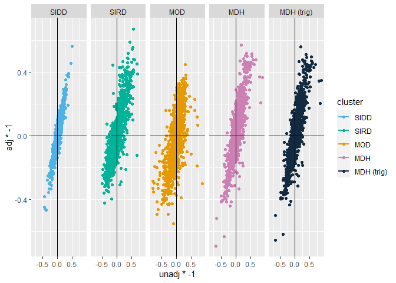

# Comparison

    load("./000.Final_Scripts/002.Clusters.Combine/Peptides_combine.RData")

    meta.SIDD.Peptides  <- updateData2(meta.SIDD.somalogic,pept)
    meta.SIDD.Peptides_adjusted  <- updateData2(meta.SIDD.Peptides_adjusted,pept)

    meta.SIRD.Peptides  <- updateData2(meta.SIRD.somalogic,pept)
    meta.SIRD.Peptides_adjusted  <- updateData2(meta.SIRD.Peptides_adjusted,pept)

    meta.MOD.Peptides  <- updateData2(meta.MOD.somalogic,pept)
    meta.MOD.Peptides_adjusted  <- updateData2(meta.MOD.Peptides_adjusted,pept)

    meta.MDH.Peptides <- updateData2(meta.MARDH.somalogic, pept)
    meta.MDH.Peptides_adjusted <- updateData2(meta.MDH.Peptides_adjusted, pept)
    meta.MDH.Peptides_adjusted_trig <- updateData2(meta.MDH.Peptides_adjusted_trig, pept)

    meta.SIDD.Peptides_adjusted$Group <-"SIDD"
    meta.SIRD.Peptides_adjusted$Group <-"SIRD"
    meta.MOD.Peptides_adjusted$Group <-"MOD"
    meta.MDH.Peptides_adjusted$Group <-"MDH"
    meta.MDH.Peptides_adjusted_trig$Group <-"MDH (trig)"

    table(meta.SIDD.Peptides_adjusted$var == meta.SIDD.Peptides$var)

    ## 
    ## TRUE 
    ## 1187

    pd <- data.frame(
      var = c(
        as.character(meta.SIDD.Peptides_adjusted$var), 
        as.character(meta.SIRD.Peptides_adjusted$var), 
        as.character(meta.MOD.Peptides_adjusted$var), 
        as.character(meta.MDH.Peptides_adjusted$var),
        as.character(meta.MDH.Peptides_adjusted_trig$var)
      ),
      
      cluster = c(meta.SIDD.Peptides_adjusted$Group, 
                  meta.SIRD.Peptides_adjusted$Group, 
                  meta.MOD.Peptides_adjusted$Group, 
                  meta.MDH.Peptides_adjusted$Group,
                  meta.MDH.Peptides_adjusted_trig$Group
      ),
      
      unadj = c(
        meta.SIDD.Peptides$Effect.random, 
        meta.SIRD.Peptides$Effect.random, 
        meta.MOD.Peptides$Effect.random, 
        meta.MDH.Peptides$Effect.random,
        meta.MDH.Peptides$Effect.random    
      ),
      
      adj = c(
        meta.SIDD.Peptides_adjusted$Effect.random,
        meta.SIRD.Peptides_adjusted$Effect.random,
        meta.MOD.Peptides_adjusted$Effect.random,
        meta.MDH.Peptides_adjusted$Effect.random,
        meta.MDH.Peptides_adjusted_trig$Effect.random
      )
    )

    pd <- na.omit(pd)

    pd$label <- NA
    pd[abs(pd$unadj) >= 0.4 & sign(pd$unadj) != sign(pd$adj),"label"] <- as.character(pd[abs(pd$unadj) >= 0.4 & sign(pd$unadj) != sign(pd$adj),"var"])
    pd$cluster <- factor(pd$cluster, levels=c("SIDD","SIRD","MOD","MDH","MDH (trig)"))

    ggplot(pd, aes(x=unadj*-1, y=adj*-1, col=cluster, group=var, label=var))+
      geom_point()+
      facet_grid(~cluster)+
      geom_smooth(method="lm", se=F)+
      geom_vline(xintercept = 0)+
      geom_hline(yintercept = 0)+
      scale_color_manual(values = c("#4DB3E6","#00B399","#E69900","#CC80B3","#132B41"))

    ## `geom_smooth()` using formula 'y ~ x'

    pdf("./000.Final_Scripts/005.Cluster follow-up/Effect size comparison Peptides.pdf", width=10, height=3)
    ggplot(pd, aes(x=unadj*-1, y=adj*-1, col=cluster, label=label))+
      geom_point(size=2)+
      facet_grid(~cluster)+
      geom_smooth(method = "lm", se=F)+
      geom_vline(xintercept = 0)+
      geom_hline(yintercept = 0)+
      scale_color_manual(values = c("#4DB3E6","#00B399","#E69900","#CC80B3","#132B41"))+
      ggrepel::geom_label_repel()+
      theme(legend.position = "none")

    ## `geom_smooth()` using formula 'y ~ x'

    ## Warning: Removed 5914 rows containing missing values (geom_label_repel).

    dev.off()

    ## png 
    ##   2
