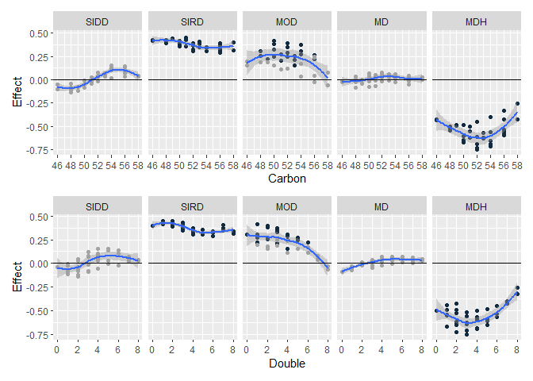

## Load

    load("D:/001_Projects/033_RHAPSODY_Shiny/www/Cluster_data.RData")
    TAG <- lipid.data[grep("TAG",lipid.data$Variable),]
    TAG$newVar <- gsub("TAG ","",TAG$Variable)
    temp <- reshape2::colsplit(TAG$newVar, ":", names=c("Carbon","Double") )
    temp$Double <- reshape2::colsplit(temp$Double, ";", names=c("Double","else") )[,1]
    TAGnew <- data.frame(TAG, temp)

    library(ggplot2)
    library(patchwork)

    TAGnew$Colour <- ifelse(TAGnew$FDR <= 0.05, "Sign","NotSign")
    TAGnew$Colour <- factor(TAGnew$Colour, levels=c("NotSign", "Sign"))

    px <- ggplot(TAGnew, aes(x=Carbon, y=Effect))+
      geom_point(aes(col=Colour))+
      facet_grid(~Cluster)+
      geom_smooth()+
      scale_x_continuous(breaks=seq(40, 60, by=2))+
      geom_hline(yintercept = 0)+
      scale_colour_manual(values = c("#A4A4A4","#132B41"))+
      theme(legend.position="none")+
    ggplot(TAGnew, aes(x=Double, y=Effect))+
      geom_point(aes(col=Colour))+
      facet_grid(~Cluster)+
      geom_smooth()+
      plot_layout(ncol=1)+
      geom_hline(yintercept = 0)+
      scale_colour_manual(values = c("#A4A4A4","#132B41"))+
      theme(legend.position="none")

    px 

    ## `geom_smooth()` using method = 'loess' and formula 'y ~ x'
    ## `geom_smooth()` using method = 'loess' and formula 'y ~ x'

    pdf("Comparison of chain length and double bond.pdf", height=5, width=6)
    px

    ## `geom_smooth()` using method = 'loess' and formula 'y ~ x'
    ## `geom_smooth()` using method = 'loess' and formula 'y ~ x'

    dev.off()

    ## png 
    ##   2
